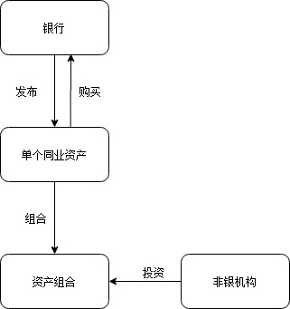
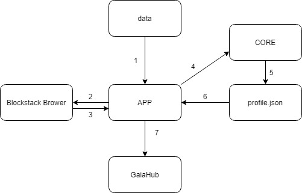
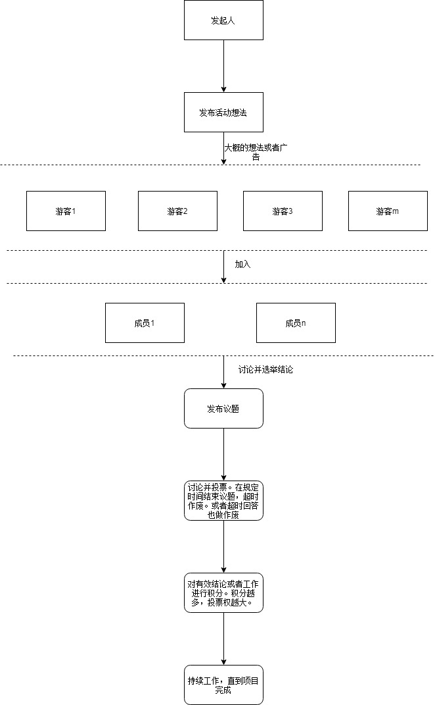

## 银行同业资产交易所(后面改成组队自治应用!)

### ID：interbank_exchange

- 1、银行作为一个主体可以上传资产。
- 2、银行间可以就该资产做交易。
- 3、交易流水记录在系统上。
- 4、不同类型资产可以协作，打包成一个资产组合。然后变成理财产品。
- 5、机构可以通过该系统投资该理财产品获得回报。

### 流程图

网址 [https://interbankexchange.netlify.com/](https://interbankexchange.netlify.com/)

### 去中心化产品添加数据交互模块设计图

### 产品技术流程图(第六课作业)
之前想做银行间资金产品交易平台，发现这个太复杂了。最近要搞Blockstack Hackathon。里面有一个应用场景还挺有趣的：在一群陌生人里面如何找到队友，确定活动（比如Hackathon项目）主题，谁当队长，团队见如何招募成员，如何交流信息。然后离开的成员如何才能不带走原先活动的信息。如何去评价团队成员在活动中的各自价值。这样一个应用场景可以发挥区块链的作用。即区块链的应用或许在速度上赶不上中心化应用，但是我们可以迅速构建人与人之间的信任关系，达到合作共赢的关系。（不一定能做出来，但是还算是一个靠谱的想法）

This project was bootstrapped with [Create React App](https://github.com/facebook/create-react-app).

## Available Scripts

In the project directory, you can run:

### `npm start`

Runs the app in the development mode. 
Open [http://localhost:3000](http://localhost:3000) to view it in the browser.

The page will reload if you make edits. 
You will also see any lint errors in the console.

### `npm test`

Launches the test runner in the interactive watch mode. 
See the section about [running tests](https://facebook.github.io/create-react-app/docs/running-tests) for more information.

### `npm run build`

Builds the app for production to the `build` folder. 
It correctly bundles React in production mode and optimizes the build for the best performance.

The build is minified and the filenames include the hashes. 
Your app is ready to be deployed!

See the section about [deployment](https://facebook.github.io/create-react-app/docs/deployment) for more information.

### `npm run eject`

**Note: this is a one-way operation. Once you `eject`, you can’t go back!**

If you aren’t satisfied with the build tool and configuration choices, you can `eject` at any time. This command will remove the single build dependency from your project.

Instead, it will copy all the configuration files and the transitive dependencies (Webpack, Babel, ESLint, etc) right into your project so you have full control over them. All of the commands except `eject` will still work, but they will point to the copied scripts so you can tweak them. At this point you’re on your own.

You don’t have to ever use `eject`. The curated feature set is suitable for small and middle deployments, and you shouldn’t feel obligated to use this feature. However we understand that this tool wouldn’t be useful if you couldn’t customize it when you are ready for it.

## Learn More

You can learn more in the [Create React App documentation](https://facebook.github.io/create-react-app/docs/getting-started).

To learn React, check out the [React documentation](https://reactjs.org/).

### Code Splitting

This section has moved here: https://facebook.github.io/create-react-app/docs/code-splitting

### Analyzing the Bundle Size

This section has moved here: https://facebook.github.io/create-react-app/docs/analyzing-the-bundle-size

### Making a Progressive Web App

This section has moved here: https://facebook.github.io/create-react-app/docs/making-a-progressive-web-app

### Advanced Configuration

This section has moved here: https://facebook.github.io/create-react-app/docs/advanced-configuration

### Deployment

This section has moved here: https://facebook.github.io/create-react-app/docs/deployment

### `npm run build` fails to minify

This section has moved here: https://facebook.github.io/create-react-app/docs/troubleshooting#npm-run-build-fails-to-minify
